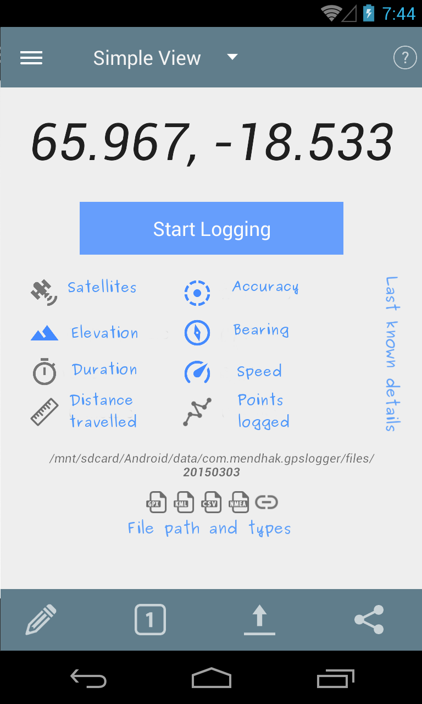

## Frequently asked questions

### Heading 3

#### Heading 4

It all comes down to your hardware, settings and environment. The *accuracy* is only as good as your phone's GPS chip. Some phones may have 4 meter accuracies, some have 500 meters. Also, using GPS satellites will give you better accuracy but take a longer time; using network location will give worse accuracy but is quicker. You may also want to check your environment, as there can be inaccuracy due to clouds, buildings, sunspots, alien invasion, etc.

Do you think code would work too?

    var x = 9;
    console.log(x);
    x++;

Or perhaps with quotes...

>`setidentifier` - a form of setting the identifier  
`inconclusive` - when it's inconclusive

Images possible?

Yes I thinkimages are possible.
